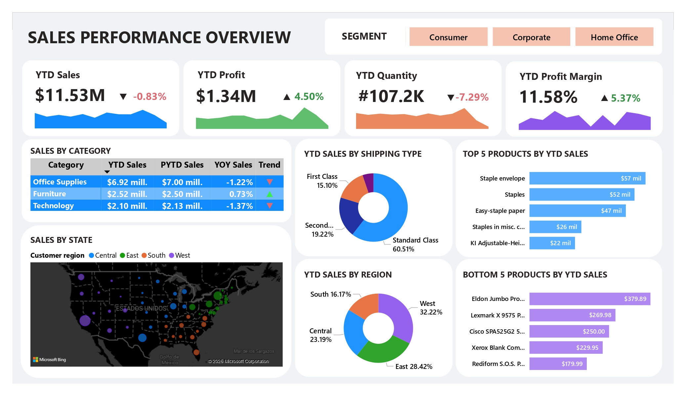

# Sales Performance Dashboard – Power BI

## Project Overview

This project presents an interactive Power BI dashboard developed to analyze sales performance across multiple business dimensions. The dashboard transforms e-commerce data into actionable insights through dynamic visualizations and KPI monitoring.

The analysis focuses on Year-to-Date (YTD) business performance, product analysis, customer segmentation, shipping behavior, and regional sales trends.


## Dashboard Preview
<p align="center">  </p>

## Objectives

- Monitor overall sales performance using key metrics.
- Track Year-to-Date business indicators.
- Identify top and underperforming products.
- Analyze sales distribution across regions.
- Evaluate category performance.
- Explore customer segments and shipping patterns.
- Support data-driven business decisions.


## Dataset

The dashboard uses e-commerce transactional data including:

- Sales information
- Profit data
- Product categories
- Customer segments
- Shipping methods
- Geographic locations
- Order quantities

Main variables used:

| Variable | Description |
|-----------|-------------|
| Sales | Total sales revenue |
| Profit | Profit generated |
| Quantity | Number of products sold |
| Category | Product category |
| Region | Sales region |
| State | Geographic state |
| Shipping type | Ship class |
| Consumer | Customer segment |


## Key Performance Indicators (KPIs)

The dashboard monitors:

✔ YTD Sales

✔ YTD Profit

✔ YTD Quantity 

✔ Profit Margin

Additionally, year-over-year comparisons are included to evaluate business growth trends.


## Dashboard Features

### Sales Performance Overview

- KPI Cards with YTD metrics
- Sales by Category analysis
- Year-over-Year trend comparison
- Sales by State map visualization
- Sales by Region distribution
- Sales by Shipping Type
- Customer Segment analysis
- Top 5 Products by Sales
- Bottom 5 Products by Sales


## Insights Generated

The dashboard enables identification of:

- Best-performing product categories
- Products with the highest sales contribution
- Underperforming products
- Regional sales patterns
- Shipping preferences
- Customer segment distribution
- Profitability trends over time


## Tools & Technologies

- Power BI Desktop
- Power Query
- DAX
- Data Modeling
- Excel / SQL


## Data Preparation

Data preprocessing included:

- Relationship modeling
- DAX calculations
- KPI measure creation
- Data transformation using Power Query

Example DAX measures:

```DAX
YTD Sales =
TOTALYTD(
    SUM(ecommerce_data[Sales]),
    'Calendar'[Date]
)

YTD Profit =
TOTALYTD(
    SUM(ecommerce_data[Profit]),
    'Calendar'[Date]
)

Profit Margin =
DIVIDE(
    [YTD Profit],
    [YTD Sales]
)
```
